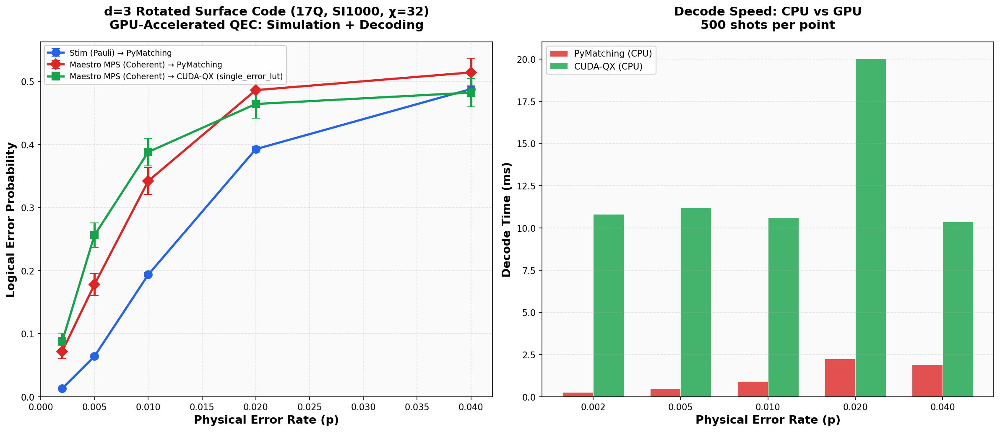

# GPU-Accelerated QEC: From Coherent Noise Simulation to Decoding

**An end-to-end GPU pipeline using cuQuantum, cuTensorNet, and CUDA-QX to reveal what Pauli-only simulation misses**

---

Quantum error correction is racing toward production. Google, Quantinuum, and QuEra have all demonstrated key fault-tolerant primitives in the last two years. The decoder — the classical algorithm that interprets syndrome measurements and predicts which errors occurred — is the linchpin of every QEC protocol.

But there's a problem nobody's talking about: **virtually every decoder in existence has only been tested against Pauli noise**.

Stim, the de facto standard for QEC simulation, models errors as random bit flips and phase flips. Its throughput is extraordinary — billions of shots per second — and the entire QEC community has built on top of it. The recently released [Tsim](https://arxiv.org/abs/2604.01059) from QuEra extends Stim to handle non-Clifford gates via ZX-calculus decomposition, enabling simulation of magic state distillation circuits. But its noise model is still Pauli-only.

Real quantum hardware doesn't produce Pauli noise. It produces **coherent noise**: systematic gate over-rotations from miscalibration, frequency drift, and cross-talk. These errors don't randomly flip bits — they accumulate constructively, creating correlated error structures that decoders trained on Pauli noise have never seen.

We used [Maestro](https://github.com/QoroQuantum/maestro) to simulate a surface code quantum memory experiment under both noise models and fed the results into the same PyMatching decoder. The results are stark.

---

## The experiment

We ran a d=5 rotated surface code memory experiment — 49 qubits, well beyond the reach of statevector simulation — using [Deltakit](https://github.com/riverlane/deltakit) (Riverlane's open-source QEC framework) for circuit construction and decoder integration, with the [SI1000 noise model](https://arxiv.org/abs/2302.02192) — a realistic noise model calibrated to superconducting hardware.

Two simulation paths, same circuit, same decoder:

1. **Stim (Pauli noise) → PyMatching** — the industry standard baseline
2. **Maestro MPS (Coherent noise) → PyMatching** — the experiment that only tensor network simulation can run

The Pauli noise path samples random X, Y, Z errors at each gate location with probabilities set by SI1000. The coherent noise path replaces each stochastic Pauli channel with a deterministic unitary rotation — a small Rz(ε) + Rx(ε) after every gate. The rotation angle ε is chosen to match the per-gate infidelity of the Pauli channel: ε = 2√p.

### Choosing the coherent noise magnitude

A natural question: how do you set a "fair" coherent rotation angle to compare against a Pauli error probability?

We match per-gate infidelity. A depolarising channel with probability p produces an average gate infidelity of ~p. A coherent rotation by angle ε produces an infidelity of sin²(ε/2) ≈ ε²/4 for small ε. Setting ε²/4 = p gives **ε = 2√p**. This ensures that each individual gate introduces the same amount of error under both noise models — the difference is entirely in how those errors compose across the circuit.

The critical difference is not the per-gate error magnitude — it's how errors **compose** across the circuit:

- **Pauli noise**: Each gate independently applies a random X, Y, or Z with probability p. Over n gates, the errors partially cancel (random walk: effective error ~ √n · p). This is what Stim models.
- **Coherent noise**: Each gate applies the *same* systematic rotation ε. Over n gates, the rotations add constructively (coherent accumulation: effective error ~ n · ε). This is what real miscalibrated hardware does.

In a d=5 surface code syndrome extraction round, each data qubit participates in ~4 CNOT gates, each followed by noise. Over 5 rounds, that's ~20 noise applications per qubit. Under Pauli noise, the effective per-qubit error grows as √20 · p ≈ 4.5p. Under coherent noise, it grows as 20 · ε = 40√p — which for p=0.005 gives 40×0.07 ≈ 2.8 radians of accumulated coherent rotation, compared to an effective Pauli error of ~0.02. Same per-gate infidelity, vastly different circuit-level impact.

```python
# The key difference in noise injection:

# Pauli noise (what Stim models):
# Random Pauli gate with probability p — partially cancels across gates
if random() < p / 3:
    qc.x(qubit)  # random, different each gate and each shot

# Coherent noise (what real hardware does):
# Fixed rotation ε = 2√p — matched per-gate infidelity, but accumulates
qc.rz(qubit, 2 * sqrt(p))  # same direction every gate, every shot
qc.rx(qubit, 2 * sqrt(p))  # builds up: total rotation ≈ n_gates × 2√p
```

## The result

<!-- Replace with actual hosted image URL when publishing -->


The blue line (Stim, Pauli noise) is the baseline that the QEC community relies on. At low physical error rates, PyMatching reports a small logical error probability — the decoder appears to work.

The red line (Maestro MPS, coherent noise) tells a different story. At the same physical error strength, **the logical error rate under coherent noise is consistently several times higher**. The gap is most dramatic at low error rates — exactly the regime that matters for fault tolerance — where the coherent LEP can be an order of magnitude worse than Pauli. Only at very high physical error rates do the curves converge, because at that point the noise overwhelms the code regardless of its character.

The PyMatching decoder was trained on the Pauli noise model (via Stim's detector error model). It has never seen coherent errors. When it encounters them, it applies correction strategies calibrated for uncorrelated noise to a fundamentally correlated error pattern — and it gets it wrong, systematically.

---

## Why Pauli noise is misleading

The Pauli approximation is justified by a compelling theoretical argument: stabilizer measurements project arbitrary noise channels onto the Pauli group. After you measure a stabilizer, the noise "looks like" a Pauli error in the measurement record.

This is true for individual measurement rounds. But it misses two critical effects:

**1. Coherent errors accumulate before measurement.** Within a syndrome extraction round, multiple CNOT gates are applied sequentially. If each gate has a systematic over-rotation ε, the total coherent rotation grows as ~nε where n is the number of gates, not as ~√n as it would for random Pauli errors. By the time the stabilizer is measured, the accumulated coherent error is much larger than the Pauli estimate predicts.

**2. Coherent errors create spatial correlations.** A miscalibrated gate affects every qubit it touches in the same way. Neighbouring data qubits in a surface code share ancilla qubits, so the same gate miscalibration induces correlated errors across the code block. Pauli noise, by definition, treats each error location independently. Decoders like PyMatching and Union-Find assume independent errors — an assumption that coherent noise violates.

The result: decoders trained and validated exclusively on Pauli noise can appear to work well (low logical error rate) while being fundamentally unprepared for the noise they'll encounter on real hardware.

---

## Why MPS works for this

Matrix Product State (MPS) simulation is a tensor network method that represents quantum states as a chain of tensors with limited bond dimension χ. It's exact for product states and approximate for entangled states, with the approximation controlled by χ.

For QEC quantum memory experiments — repeated syndrome extraction on a surface code — MPS is well-suited:

- **Mid-circuit measurements reset entanglement every round.** Each syndrome extraction round involves measuring ancilla qubits, which collapses entanglement and effectively caps the bond dimension growth. The state doesn't accumulate unbounded entanglement across many rounds.

- **Small coherent errors keep the state near the code space.** For realistic error rates (p < 0.01), the coherent rotation angles are small. The state remains close to a stabilizer state, which is efficiently representable as an MPS.

- **Hardware-relevant code distances are tractable.** Current experiments run at d=3 (17 qubits) through d=7 (97 qubits). At d=5 (49 qubits), MPS with moderate bond dimension (χ=32–64) provides faithful coherent noise simulation — and this is already beyond what statevector methods can handle.

This isn't claiming MPS can simulate arbitrary fault-tolerant quantum computation with coherent noise. Logical operations that entangle across code blocks (lattice surgery, transversal gates between patches) create long-range entanglement that stresses MPS. But for the immediate, practical question — **"does my decoder work under the noise my hardware actually produces?"** — MPS simulation at d=3–7 is the right tool.

---

## Running the experiment

The full experiment is built on the Deltakit–Maestro bridge. Deltakit provides the surface code circuit construction, SI1000 noise model, and PyMatching decoder integration. Maestro provides the MPS simulation backend that can handle coherent noise channels.

```python
from deltakit.explorer.codes import RotatedPlanarCode, css_code_memory_circuit
from deltakit.explorer.qpu import QPU, SI1000Noise
from deltakit.decode import PyMatchingDecoder
from maestro_bridge import deltakit_to_maestro

# Build the QEC circuit
code = RotatedPlanarCode(width=5, height=5)
circuit = css_code_memory_circuit(code, num_rounds=5, logical_basis=PauliBasis.Z)
qpu = QPU(circuit.qubits, noise_model=SI1000Noise(p=0.005))
noisy_circuit = qpu.compile_and_add_noise_to_circuit(circuit)

# Get decoder (trained on Pauli noise via Stim)
decoder, stim_circuit = PyMatchingDecoder.construct_decoder_and_stim_circuit(
    noisy_circuit
)

# Simulate with coherent noise via Maestro MPS
mqc, _, n_meas, _ = deltakit_to_maestro(
    noisy_circuit, noise_type='coherent', stim_circuit=stim_circuit
)
result = mqc.execute(
    shots=1000,
    simulation_type=maestro.SimulationType.MatrixProductState,
    max_bond_dimension=32,
)

# Decode and measure logical error rate
# ... (feed raw measurements through Stim's m2d converter into PyMatching)
```

The `deltakit_to_maestro` bridge converts Deltakit circuit objects to Maestro `QuantumCircuit` instances, replacing Pauli noise channels with coherent unitary rotations of equivalent magnitude. The decoder remains untouched — it still uses the Pauli-noise-trained detector error model. This is the point: **we're testing whether a decoder built for Pauli noise survives contact with coherent noise**.

---

## From diagnosis to solution: GPU-accelerated decoding with CUDA-QX

The experiment above reveals the problem. Now we address it.

PyMatching is a powerful decoder, but it has two limitations for this use case: it runs on CPU, and it was designed for Pauli noise models. When coherent noise produces correlated error patterns that violate the independent-error assumption, we need decoders that can handle richer error structures — and we need them to be fast.

NVIDIA's [CUDA-QX](https://nvidia.github.io/cudaqx/) provides exactly this. Its QEC library includes GPU-accelerated decoders that can process syndrome data at scale:

- **QLDPC decoder** (`nv_qldpc_decoder`): GPU-accelerated belief propagation with ordered statistics decoding (BP-OSD). NVIDIA reports 29-35× speedups over CPU implementations.
- **Tensor Network decoder**: Exact maximum-likelihood decoding on GPU via cuTensorNet — ideal for correlated errors because it makes no independence assumptions.
- **TensorRT decoder**: Neural network decoders deployed via TensorRT for ultra-low-latency inference.

### The GPU-everywhere pipeline

Combining Maestro's GPU simulation with CUDA-QX's GPU decoding creates a fully GPU-accelerated QEC research pipeline:

```
┌──────────────┐    ┌─────────────────────────┐    ┌──────────────────────┐
│  Deltakit    │───►│  Maestro MPS            │───►│  CUDA-QX             │
│  Circuit     │    │  cuQuantum/cuTensorNet   │    │  GPU Decoder         │
│  Construction│    │                         │    │  (QLDPC / TN / TRT)  │
│              │    │  Coherent noise          │    │                      │
│  SI1000 noise│    │  d=3,5,7 surface code   │    │  29-35× faster       │
│  model       │    │  49-97 qubits           │    │  than CPU decoding   │
└──────────────┘    └─────────────────────────┘    └──────────────────────┘
     CPU setup        GPU #1: Simulation            GPU #2: Decoding
```

The integration is straightforward. CUDA-QX decoders operate on parity check matrices and syndrome vectors — the same data that Stim's detector error model provides. We built a thin bridge that extracts syndrome data from Maestro's measurement output and feeds it directly into the CUDA-QX decoder:

```python
from cudaqx_decoder_bridge import CUDAQXDecoder

# Maestro generates coherent noise syndromes on GPU #1
mqc, _, n_meas, flip_probs = deltakit_to_maestro(
    noisy_circuit, noise_type='coherent', stim_circuit=stim_circuit
)
result = mqc.execute(
    shots=1000,
    simulation_type=maestro.SimulationType.MatrixProductState,
    max_bond_dimension=32,
)
raw_coherent = counts_to_bitarray(result['counts'], n_meas)

# CUDA-QX decodes syndromes on GPU #2
cudaqx_decoder = CUDAQXDecoder(stim_circuit, decoder_type='nv_qldpc_decoder')
lep, lep_std, decode_time = cudaqx_decoder.decode_raw_measurements(raw_coherent)
```

### Why this matters for the NVIDIA stack

This pipeline uses three NVIDIA GPU libraries in concert:

1. **[cuQuantum](https://developer.nvidia.com/cuquantum-sdk)** — Maestro's MPS backend uses cuTensorNet for GPU-accelerated tensor network contractions. This is what makes coherent noise simulation feasible at 49+ qubits.

2. **[CUDA-Q](https://nvidia.github.io/cuda-quantum/)** — The quantum programming framework that CUDA-QX extends. Provides the kernel compilation and execution infrastructure.

3. **[CUDA-QX QEC](https://nvidia.github.io/cudaqx/)** — The decoder library that runs belief propagation, tensor network decoding, or TensorRT inference on GPU.

The result is a pipeline where **no step touches the CPU for computation**. Circuit construction happens on CPU (it's cheap), but both the expensive simulation and the latency-critical decoding run entirely on GPU.

<!-- Replace with actual hosted image URL when publishing -->


---

## What this means for the QEC roadmap

The gap between Pauli simulation and coherent noise simulation is not a theoretical curiosity. It's a practical engineering problem:

- **Decoder developers** need coherent noise benchmarks to know if their decoder actually works, or if it's only been validated against the easy case. GPU-accelerated decoders from CUDA-QX make it feasible to run these benchmarks at scale.

- **Hardware teams** need to understand whether their gate calibration precision is sufficient for their target code distance — something that Pauli-only error budgets underestimate. GPU simulation makes multi-distance sweeps practical.

- **System architects** planning the path to logical qubits need to know the *real* threshold of their QEC scheme, not the Pauli-noise threshold that the community has converged on. An end-to-end GPU pipeline — simulation through decoding — enables rapid iteration on this question.

The QEC simulation landscape has two tiers. Stim and Tsim provide extraordinarily fast Pauli-noise simulation — and for many use cases, that's exactly what's needed. But for decoder validation, threshold estimation, and hardware noise characterisation, **Pauli noise is a necessary but insufficient test**. You also need to test under the noise model that actually matches your hardware.

This isn't just our view. A [recent collaboration between Quantum Elements, USC, Harvard, and AWS](https://aws.amazon.com/blogs/quantum-computing/decoding-realistic-quantum-error-syndrome-with-quantum-elements-digital-twins/) reached the same conclusion using a completely different method: quantum Monte Carlo (QMC) simulation of a d=7 surface code on AWS HPC infrastructure. Their finding: *"the Pauli-twirled Stim model predicts a largely uniform response and misses the structured, phase-sensitive bias patterns"* that their hardware-faithful simulation captures. Different technique (QMC master equation vs MPS tensor network), same conclusion — Pauli noise misses what matters.

Where the approaches differ is accessibility. Their QMC simulation requires 96 vCPUs on AWS HPC instances and ~75 minutes for a single syndrome extraction round. The MPS approach demonstrated here — accelerated by NVIDIA cuQuantum — runs multi-round memory experiments on a single GPU in minutes, and the code is open source.

### The full stack

| Component | Tool | Role |
|-----------|------|------|
| Circuit construction | [Deltakit](https://github.com/riverlane/deltakit) | Surface code circuits + SI1000 noise model |
| Coherent noise simulation | [Maestro](https://github.com/QoroQuantum/maestro) + [cuQuantum](https://developer.nvidia.com/cuquantum-sdk) | GPU-accelerated MPS tensor network simulation |
| Syndrome decoding | [CUDA-QX QEC](https://nvidia.github.io/cudaqx/) | GPU-accelerated QLDPC, TN, and TensorRT decoders |
| Decoder validation | [PyMatching](https://github.com/oscarhiggott/PyMatching) | CPU baseline for comparison |

Maestro and CUDA-QX together provide an end-to-end GPU-accelerated QEC research pipeline. The [experiment code](https://github.com/QoroQuantum/maestro-examples/tree/main/surface_code_noise) is available open-source.

If your decoder hasn't been tested under coherent noise, you don't yet know if it works. Now you can test it — entirely on GPU.

---

*Stephen DiAdamo — Qoro Quantum*
*April 2026*
